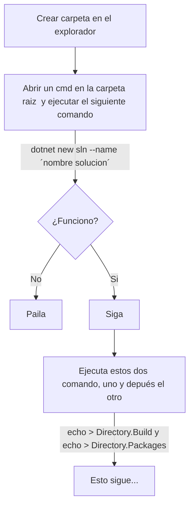

# Proyecto Trinity

# Contenido
- [Pasos creación Plantilla-Andamio](#pasos-creación-plantila-andamio)
- [Control de cambios](#control-de-cambios)

---

## Pasos creación Plantila-Andamio

[🔙 Contenido](#contenido) 

## Control de cambios
| Nombre editor | Fecha actualizacion |
|---------------|---------------------|
| Anfeta        | 2024/12/04          |

[🔙 Contenido](#contenido) 
