# Proyecto Trinity

# Contenido
- [Pasos creación Plantilla-Andamio](#pasos-creación-plantila-andamio)
- [Control de cambios](#control-de-cambios)

---

## Pasos creación Plantila-Andamio

```mermaid

flowchart TD
A[Crear carpeta en el explorador] --> B[Abrir un cmd en la carpeta raiz  y ejecutar el siguiente comando]
B --> |dotnet new sln --name ´nombre solucion´| C{¿Funciono?}
C --> |No| D[Paila]
C --> |Si| E[Siga]
E --> E1[Ejecuta estos dos comando, uno y depués el otro]
E1 --> |echo > Directory.Build y echo > Directory.Packages| E2[Esto sigue...]

```

[🔙 Contenido](#contenido) 

## Control de cambios
| Nombre editor | Fecha actualizacion |
|---------------|---------------------|
| Anfeta        | 2024/12/04          |

[🔙 Contenido](#contenido) 
