# Proyecto Trinity

# Contenido
- [Pasos creación Plantilla-Andamio](#pasos-creación-plantila-andamio)
- [Infraestuctura](#infraestructura)
    - [Rediscache](#rediscache)
- [Respuesta API](#respuesta-api)
- [Control de cambios](#control-de-cambios)
---
    
## Pasos creación Plantila-Andamio

```mermaid
flowchart TD
A[Crear carpeta en el explorador] --> B[Abrir un cmd en la carpeta raiz  y ejecutar el siguiente comando]
B --> |dotnet new sln --name ´nombre solucion´| C{¿Funciono?}
C --> |No| D[Paila]
C --> |Si| E[Siga]
E --> E1[Ejecuta estos dos comando, uno y depués el otro]
E1 --> |echo > Directory.Build y echo > Directory.Packages| E2[Esto sigue...]
```


[🔙 Contenido](#contenido) 

## Infraestructura
 - .Net8
 - MongoDB
 - RedisCache

## Respuesta API
```json
{
    "success": true, // Resultado del proceso
    "message": "Id de usuario con IdDocument 1000758512 obtenido correctamente", // Mensaje final del proceso
    "statusCode": 200, // Codigo estado del proceso
    "data": (string, objetos, arrays) // Este dato es un generico y puede traer cualquier resultado que la operación requiera
}
``` 

### RedisCache
Comando para correr el servidor de rediscache localmente:   
```
redis-server.exe redis.windows.conf
```

## Control de cambios
| Nombre editor | Fecha actualizacion |
|---------------|---------------------|
| Anfeta        | 2024/12/04          |
| Anfeta        | 2024/12/16          |
| Anfeta        | 2024/12/20          |
| Anfeta        | 2024/12/26          |

[🔙 Contenido](#contenido) 
