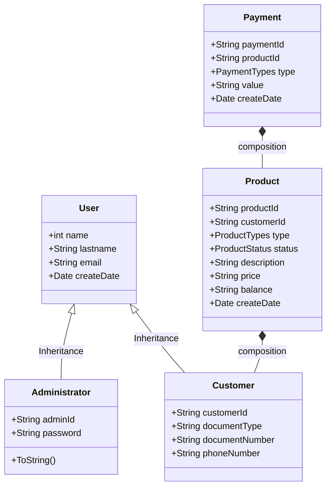

# Contenido

- [Diagrama de clases](#diagrama-de-clases)

## Diagrama de clases

```mermaid
classDiagram

    User <|-- Administrator : Inheritance
    User <|-- Customer : Inheritance
    User : +int name
    User : +String lastname
    User : +String email
    User : +Date createDate

    Administrator : +String adminId
    Administrator : +String password
    Administrator : +ToString()

    Customer : +String customerId
    Customer : +String documentType
    Customer : +String documentNumber
    Customer : +String phoneNumber
    
    Product *-- Customer : composition
    Product : +String productId
    Product : +String customerId
    Product : +ProductTypes type
    Product : +ProductStatus status
    Product : +String description
    Product : +String price
    Product : +String balance
    Product : +Date createDate

    Payment *-- Product : composition
    Payment : +String paymentId
    Payment : +String productId
    Payment : +PaymentTypes type
    Payment : +String value
    Payment : +Date createDate

```